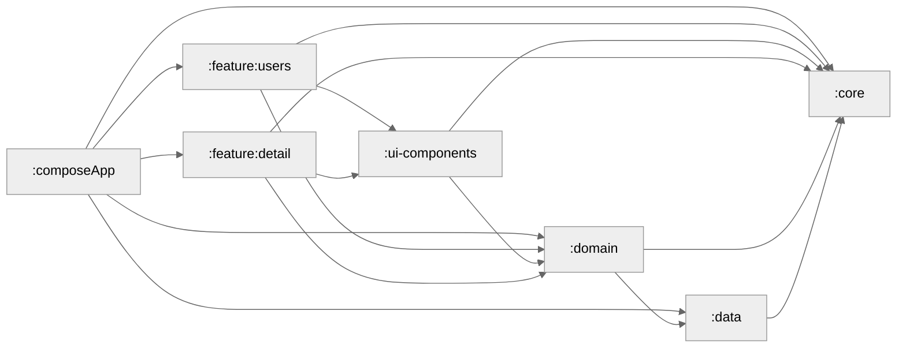

# Kotlin Multiplatform GitHub Users App

A Kotlin Multiplatform (KMP) sample project targeting Android and iOS, designed as a reference implementation of **Clean Architecture**, **Dependency Injection**, and **Modularization**. It demonstrates how to share business logic, networking, and caching between platforms while keeping a clean separation of concerns and maintaining offline support.


## Features
- **GitHub Users Directory**: Browse GitHub users with seamless pagination.
- **Detailed User Profile**: View detailed user information including username, avatar, biography, followers, following, and more.
- **Local Database Caching**: Offline support using **SQLDelight** database for persistent local storage.
- **Rate Limit Resilience**: Easily configure a GitHub API token to bypass public API rate limits.
- **Shared Architecture**: Multi-module setup with clean separation of concerns, dependency injection, and modern reactive streams.

---


## Technical Stack & Dependencies
- **UI & Presentation**: [Compose Multiplatform](https://jb.gg/compose) for shared declarative UI.
- **Navigation**: Jetpack [Navigation Compose](https://developer.android.com/develop/ui/compose/navigation) for Compose Multiplatform.
- **Dependency Injection**: [Koin](https://insert-koin.io/) (`koin-core`, `koin-compose`, `koin-compose-viewmodel`) for dependency injection across shared modules.
- **Networking**: [Ktor Client](https://ktor.io/) for network requests with platform-specific engines (OkHttp for Android, Darwin for iOS).
- **Serialization**: [Kotlinx Serialization](https://github.com/Kotlin/kotlinx.serialization) for JSON parsing.
- **Database / Caching**: [SQLDelight](https://sqldelight.github.io/sqldelight/) for platform-native SQL database engines.
- **Image Loading**: [Coil 3](https://coil-kt.github.io/coil/) for loading user avatars asynchronously in Compose Multiplatform.
- **Asynchronous Logic**: Kotlin [Coroutines](https://github.com/Kotlin/kotlinx.coroutines) + [Flow](https://kotlin.github.io/kotlinx.coroutines/kotlinx-coroutines-core/kotlinx-coroutines-flow/) for asynchronous flow and state management.

---

## Architecture & Module Structure

This project follows a clean multi-module architecture to enforce separation of concerns, maximize code reuse, and optimize Gradle build times.

```
├── build-logic                   # Custom Gradle convention plugins for KMP and Compose build configs
├── composeApp                    # Shared application module (AppNavHost, DI entrypoint, UI themes, platforms main)
│   ├── androidMain               # Android platform entry points (MainActivity)
│   ├── iosMain                   # iOS platform entry points (MainViewController)
│   └── commonMain                # App navigation, global theme configurations, and root container
├── core                          # Shared core foundation models, dispatchers, and base UseCases
├── ui-components                 # Shared custom UI components (UserItem, TopBar, SnackBar, GenericLazyList, etc.)
├── data                          # Shared data layer (Ktor network ApiClient, SQLDelight DB local implementation, and Repositories)
├── domain                        # Shared domain business logic, managers (UserManager), and domain UseCases
├── feature                       # Feature-specific modules
│   ├── users                     # Users list screen, UsersViewModel, and feature navigation contract
│   └── detail                    # User detail screen, DetailViewModel, and feature navigation contract
├── iosApp                        # Native iOS Xcode application project (SwiftUI wrapper)
└── gradle                        # Version catalog (libs.versions.toml) and Gradle wrapper
```
---
### Module Graph


---

## Getting Started

### Prerequisites
- **macOS** (for running the iOS application)
- **Xcode** 15+
- **Android Studio** (Koala or newer) with **Kotlin Multiplatform** plugin installed
- **JDK 17**

### Configure GitHub API Key
The GitHub public API limits unauthenticated requests to 60 per hour. To avoid rate-limiting issues:
1. Open the [DataModule.kt](data/src/commonMain/kotlin/com/example/githubuser/data/di/DataModule.kt) file.
2. Replace `GITHUB_APIKEY` with your personal GitHub token:
```kotlin
const val GITHUB_APIKEY = "your_github_personal_access_token"
```

### Build & Run
You can run targets via Android Studio or using Gradle commands:

#### Running Android Application
To run the Android app via Gradle:
```bash
./gradlew :composeApp:installDebug
```
Or open the project in Android Studio, select `composeApp` run configuration, and press **Run**.

#### Running iOS Application
To run the iOS application:
1. Open the `/iosApp` directory in **Xcode**.
2. Select your simulator/device target.
3. Click the **Run** button.

---

## Running Tests
Unit tests are implemented across various modules using shared test suites.

To run all unit tests:
```bash
./gradlew test
```

To run tests on specific modules:
- **Domain tests**: `./gradlew :domain:test`
- **Data tests**: `./gradlew :data:test`
- **Core tests**: `./gradlew :core:test`